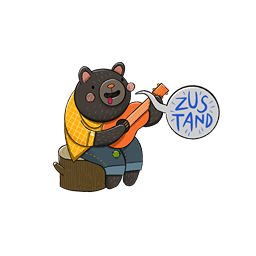

# React - Tic Tac Toe

The main goal behind this project was to create a visually pleasing Tic Tac Toe game using React and Tailwind CSS.

## Technologies

  
  
  
  
  
  
  
  

## AI

The AI used in this project implements the [minimax algorithm](http://en.wikipedia.org/wiki/Minimax).
